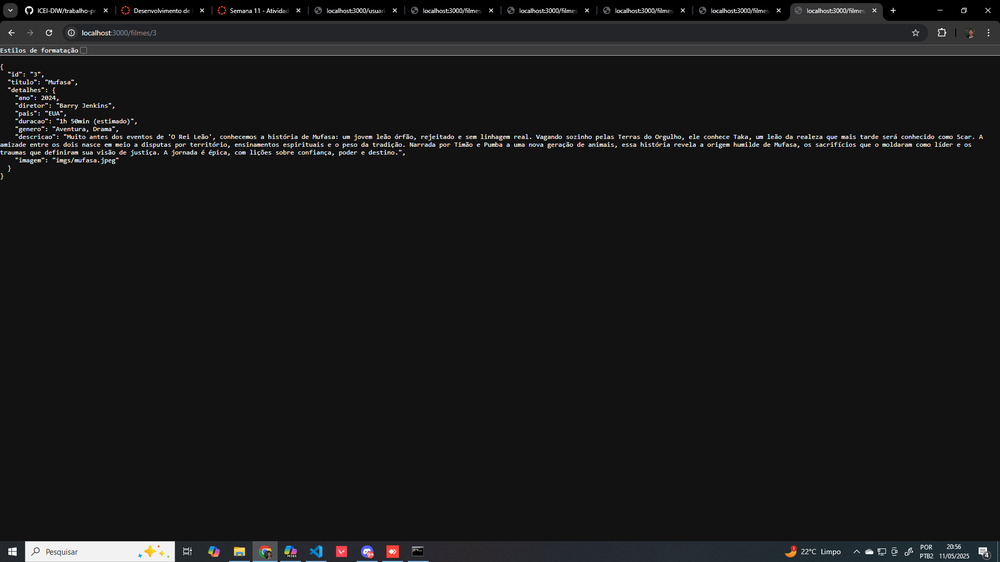
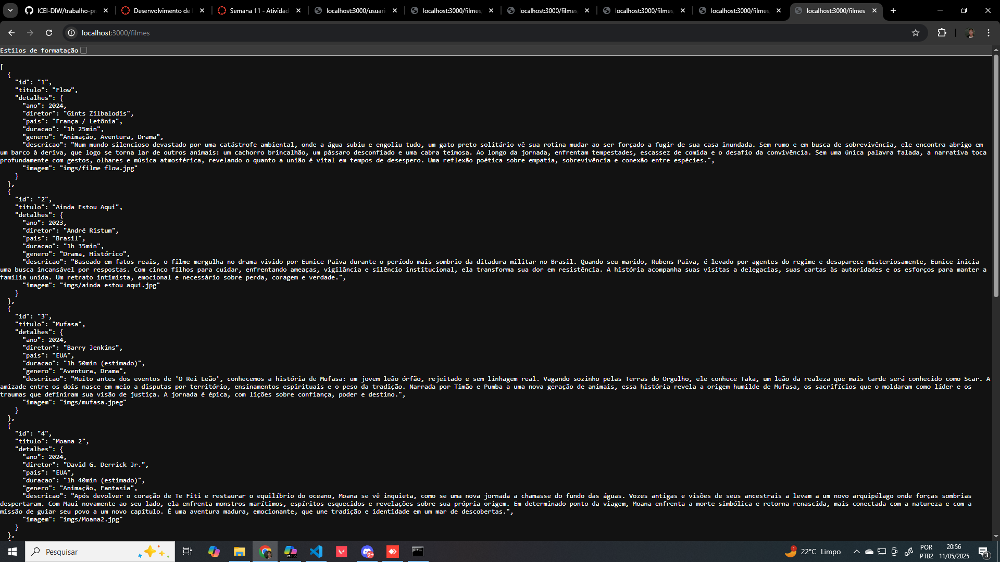
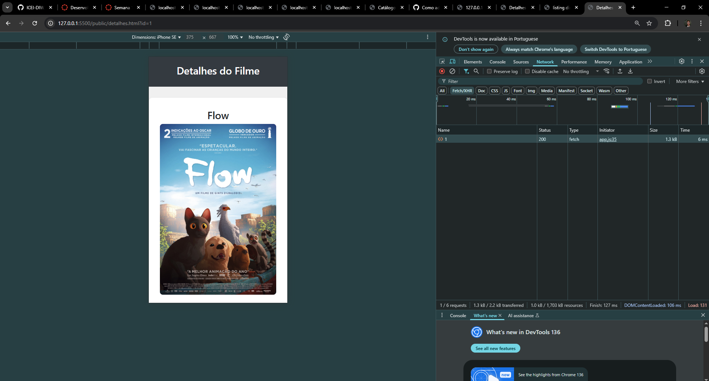

# Trabalho Prático - Semana 11

Nessa etapa, vamos evoluir o projeto anterior e contemplar um ambiente de desenvolvimento mais completo, típico de equipes profissionais. Nesse processo, vamos utilizar um **servidor backend simulado** com o **JSON Server** baseado em APIs RESTful. Um arquivo JSON funcionará como banco de dados e será processado pelo JSON Server que expõe uma API RESTful no servidor.

## Informações do trabalho

- Nome: Lucas Guimarães Pós
- Matricula: 894068
- Proposta de projeto escolhida: Catálogo de Filmes
- Breve descrição sobre seu projeto: Catálogo de Filmes para um desenvolvedor amador testar conceitos, no desse trabalho , API e Fetch.

**Print do teste da API com visualização do JSON**

**Print da aba NETWORK com requisições Fetch/XHR**

5. Para testar o projeto:
   1. **Site Front End**: abra um navegador e acesse o seu site pela seguinte URL: 
      [http://localhost:3000]()
   2. **Site Back End**: abra o navegador e acesse as informações da estrutura de usuários por meio da API REST do JSONServer a partir da seguinte URL: 
      [http://localhost:3000/usuarios](http://localhost:3000/usuarios)

      !!!!!!!!!!!!!     USEI:     /FILMES !!!!!!!!!
